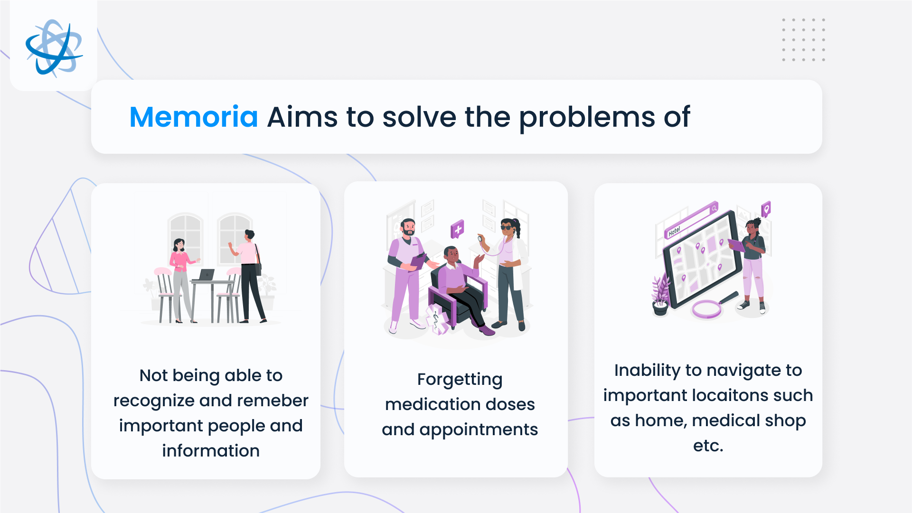
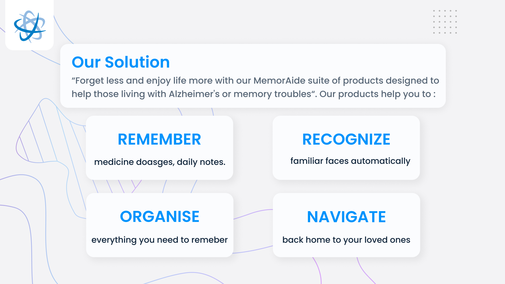
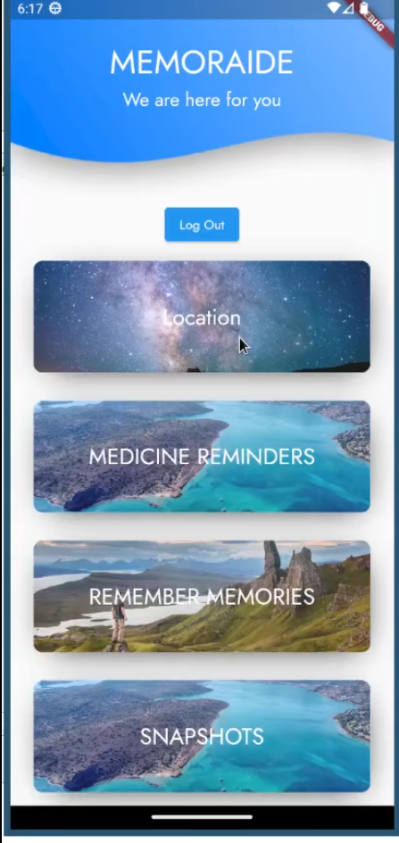
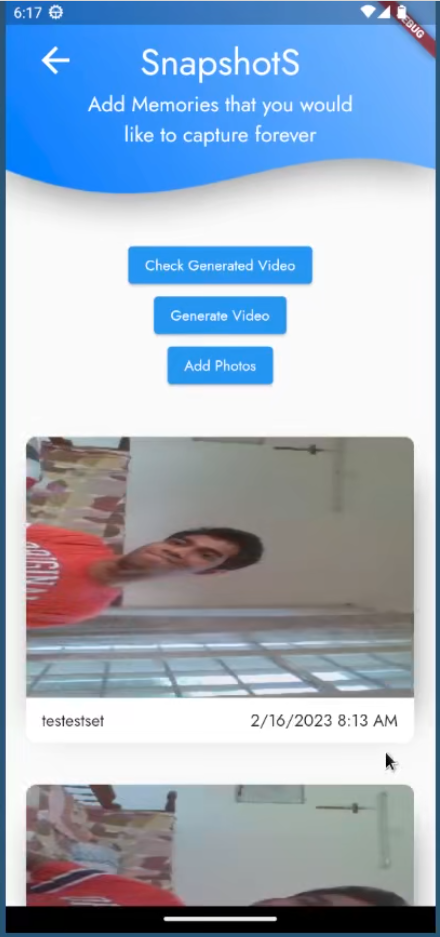
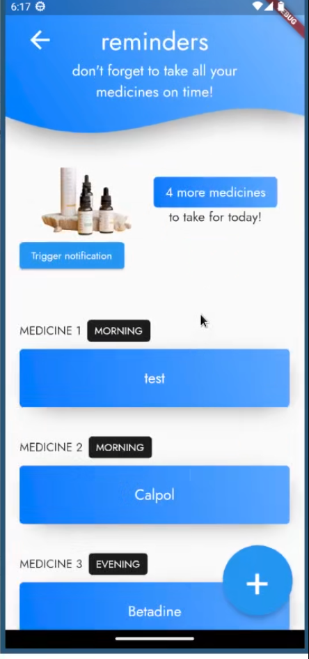
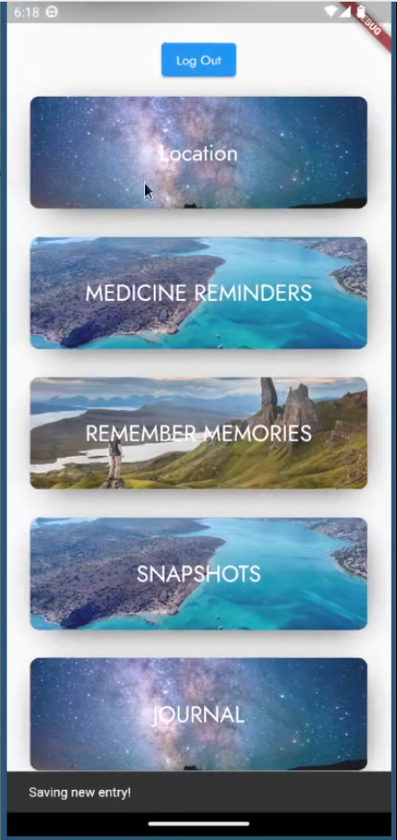

# Memoraide

A flutter based mobile application for people with memory troubles and their caregivers.

## Abstract

People suffering from Alzheimer's or other memory related issues often face a wide variety of problems like:

1. Forgetting about medicine reminders:
   1. What medicine to have
   2. When exactly to have that medicine 
   3. Weather they have already had the medicine
2. Navigation issues - People with memory troubles, when trying to travel alone,
   1. Often forgets where exactly they were planning to go
   2. Forgets the way to the location
   3. Forgets the way backwards to go home
3. Forgetting what they have done and completed
   1. At the end of a day or a week, people forget what all they have accomplished
   2. We move along everyday monotonously without paying attention to what all we have accomplished
   3. We feel our lives may have been uneventful when all the while there were many slivers of memories which we may have forgotten
4. Forgetting familiar faces and objects
   1. Sometimes, you may see a person's face and suddenly get the feeling that you've seen this person somewhere but can't exactly recollect where
   2. Same thing applies for objects like photos or chains or watches where you feel that this thing is valuable and has a memory associated with it, but can't recollect exactly what.

With Memoraide, we are hoping to fix all the above problems. 

We hope to be a one stop mobile application for those suffering from memory issues

As of now, our app has features to solve all the above listed problems

## Features

- Medicine Reminders with notification alerts
- GeoLocation based navigation feature
- Snapshot feature which prompts users to take a snapshot photos regularly and then later makes a video of all these snapshots combine together(quick review of everything that went through during a day)
- Journal feature for listing down thoughts and memories
- Remembrance feature using powerful ML model to list out features of a particular object or a familiar face and then later find details of it using a single snapshot.
- Notification at regular intervals to help remember about the app and taking snapshot photos.

## Future plans

- Separate views for users with caretaker role who can track the patient and set up reminders + alerts
- More Beta-Testing

## Video Demo

Check [these](demo/videos)

## Tech stack:

1. Flutter for mobile app
2. Firebase for database and authentication
3. Flask (python) for backend
4. PyTorch and FastAi for ML processing

## Screenshots 

## Other links

- Backend repository - [https://github.com/aldrinjenson/memoria-backend](https://github.com/aldrinjenson/memoria-backend)
